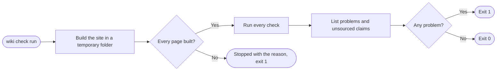

+++
title = "Checks"
subtitle = "every refusal wiki check makes, grouped by kind"
status = "approved"
intent = """
The checks exist so that a wiki read instead of the code cannot quietly stop being true. Each one refuses
a way documentation has been seen to rot, and together they should name every problem at once, in
sentences a person can act on.
"""

# Every check page uses these headings, in this order, and only these infobox labels.
[family]
headings = ["Refusals", "Scope", "Exceptions", "Enforcement", "Clearing"]
labels = ["Syntax", "Setting", "Record", "Command", "Page limit", "Intent limit", "Goals limit", "Refusals",
          "Scope", "Exceptions", "Enforcement", "Clearing"]

[[infobox]]
group = "Identity"
rows = [
  { label = "Command", value = "wiki check", cite = "check" },
]

[[infobox]]
group = "Exit codes"
rows = [
  { label = "Success", value = "0", cite = "check" },
  { label = "Problems", value = "1", cite = "check" },
  { label = "Misuse", value = "2", note = "such as no wiki at the path", cite = "check" },
]

[[infobox]]
group = "Rules"
rows = [
  { label = "Reporting", value = "every problem at once", cite = "check" },
  { label = "Build stoppage", value = "that problem alone", cite = "caught" },
]
+++

`wiki check` builds the site in a temporary folder and lists **every problem at once**, not only the
first.[^check] It exits with 0 for a sound wiki, 1 when it finds a problem, and 2 when it is misused,
such as pointed where there is no wiki.[^check] The same check runs on every push and pull request
through [Continuous integration](continuous-integration.md). A check proves that a sentence cites
something, not that the citation is true; an agent checks that from the [Review prompt](review-prompt.md).
Each check's page, such as [Citations](checks/citations.md), covers its refusals, scope, exceptions,
enforcement and clearing.

## Order

Every check runs before the result is decided, so one problem never hides another.[^check][^caught]

## Refusals

| Refused | Described on |
|---|---|
| A sentence that cites nothing, or a reference to a document[^cited] | [Citations](checks/citations.md) |
| A table the renderer will not draw as a table[^tables] | [Tables](checks/tables.md) |
| An infobox row that cites nothing[^rows] | [Citations](checks/citations.md) |
| A heading that asks a question, rates its contents or points at the page[^headings] | [Headings](checks/headings.md) |
| A name or sentence that points at the page, hides who acts, attributes a rule to a person or carries no fact[^wording] | [Wording](checks/wording.md) |
| A spelling or a word the wiki's English does not use[^english] | [Plain English](checks/wording/plain-english.md) |
| A link to a wiki page that does not exist[^deadlinks] | [Site](site.md) |
| A page longer than its budget[^budget] | [Reading budgets](checks/budgets.md) |
| A picture whose subject has changed[^pictures] | [Pictures](checks/pictures.md) |
| A link to a PDF outside the files folder or missing from it, or a PDF over 20 MB[^pdfs] | [PDFs](checks/pdfs.md) |
| A family member's heading or infobox label its parent's layout does not list, or a member its parent does not link[^families] | [Families](checks/families.md) |
| An index table the build cannot write, or a pattern matching no page[^index] | [Index tables](pages/index-tables.md) |
| A page edited since its date was recorded[^dates] | [Site](site.md) |
| A wiki written against a different release of the tool[^version] | [Delivery](skill/delivery.md) |

## Stoppages

Some problems **stop the build** instead of joining the list, such as a missing `wiki.toml` or `goals.md`,
a page with no title or intent, a page that no reader can reach, a sidebar naming a page that does not exist,
a picture with no record, a PDF that links to a file outside the files folder, or a files folder that is a
symbolic link.[^stop] When that happens, only that one problem is reported, as a single
sentence, and the command exits with 1.[^caught]

[^check]: `src/builder/build.py` — `check()` builds into a temporary folder and gathers every problem;
    `src/builder/cli.py` — `run()` prints them and returns 1 if there are any and 0 if not, and `main()`
    returns 2 when there is no wiki.
[^cited]: `src/builder/build.py` — `uncited_problems()` and `citation_problems()`.
[^rows]: `src/builder/build.py` — `infobox_problems()`.
[^tables]: `src/builder/build.py` — `table_problems()`.
[^headings]: `src/builder/build.py` — `heading_problems()`.
[^wording]: `src/builder/build.py` — `pointing_problems()`, `vague_actor_problems()`,
    `attribution_problems()` and `empty_word_problems()`.
[^english]: `src/builder/build.py` — `plain_english_problems()`.
[^deadlinks]: `src/builder/build.py` — `dead_link_problems()`.
[^budget]: `src/builder/build.py` — `budget_problems()`.
[^pictures]: `src/builder/build.py` — `picture_problems()`.
[^pdfs]: `src/builder/build.py` — `pdf_problems()`.
[^families]: `src/builder/build.py` — `family_problems()`.
[^index]: `src/builder/build.py` — `index_problems()`.
[^dates]: `src/builder/build.py` — `date_problems()`.
[^version]: `src/builder/build.py` — `version_problems()`.
[^stop]: `src/builder/config.py` — `read_config()`; `src/builder/build.py` — `read_pages()`,
    `write_site()`, `render_nav()`, `render_infobox()`, `rewrite_references()`, `filed_pdf()` and
    `subject_digest()` raise `WikiError`.
[^caught]: `src/builder/cli.py` — `main()` catches `WikiError`, prints it, and returns 1.
