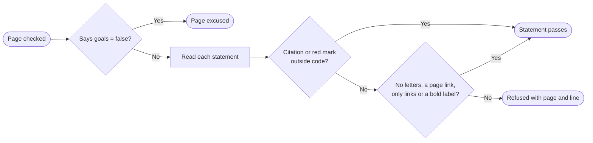

+++
title = "Citations"
subtitle = "a citation or the missing mark on every sentence, table row and infobox row"
status = "approved"
categories = ["Refusals"]
intent = """
Citations exist so that a reader who cannot read the code can still tell a checked sentence from a guess.
Every statement should lead to the code it came from, or to the documentation of the outside service it
describes, or say plainly that nothing was found.
"""

[[infobox]]
group = "Identity"
rows = [
  { label = "Syntax", value = "markdown footnote", cite = "render" },
]

[[infobox]]
group = "Rules"
rows = [
  { label = "Refusals", value = "an uncited sentence, table row or infobox row", cite = ["uncited", "rowcite", "rows"] },
  { label = "Scope", value = "every sentence, table row and infobox row", cite = ["uncited", "rowcite", "rows"] },
  { label = "Exceptions", value = "code samples, the header row, any page with goals = false", cite = ["excused", "rowcite", "exempt"] },
  { label = "Clearing", value = "the red mark, written {missing}", cite = "mark" },
]
+++

A **citation** is a numbered mark at a claim, with its reference at the foot of the page, written as a
markdown footnote.[^render] Three checks hold citations to account: one each for a sentence and an infobox
row that cite nothing, and one for a reference that cites the wrong kind of thing, described on
[References](citations/references.md).[^three]

## Refusals

### Silence

Every sentence must carry a citation, or the red mark that says there is none.[^uncited] If one does not,
the check names the page and the line, and quotes the sentence.[^uncited] **The check looks for the mark,
not the reference behind it**: a sentence naming a footnote the page never defines passes, and shows the
mark as plain text.[^undefined] Each statement passes or is refused this way.[^uncited]

A citation after the full stop belongs to its sentence, and **a sentence never borrows its neighbor's
citation**.[^uncited]

**Every table row carries a citation, or the red mark, in at least one of its cells**; a table whose rows cite
nothing is a gap, not an excuse.[^rowcite]

An infobox row cites a footnote the page's text also cites, and carries that citation's number, or is
marked as having no source; a row with neither, or citing a footnote no sentence uses, is refused.[^rows]

## Scope

A version number does not end a sentence, but an abbreviation followed by a capital does, so `Dr. Smith` is
read as two sentences.[^boundary] A sentence directly under a heading is checked like any other.[^heading]

## Exceptions

Six things are excused: a statement with no letters; a sentence linking to any markdown file, even a missing
page, which the check described on [Site](../site.md) refuses on its own; a statement that is nothing but
links; a bold label; a code sample; and a picture with its caption.[^excused] The header row is
exempt.[^rowcite] A page that says `goals = false` is excused from the rules for sentences and infobox
rows, whatever it describes.[^exempt]

**Links count inline or by name, one or several**, and a link's address where it is defined is not a
statement; a word between two links makes the line prose, and prose is a claim.[^links] **A bold label**
is excused because the full stop inside it ends the sentence, leaving a label no citation could sit
on.[^label]

## Clearing

Where nothing can be cited, the writer puts the word *missing* in curly braces, and it renders as a red
question mark in brackets.[^mark] **It is a fine answer; silence is not.**[^uncited] It means the thing is
not built or where it happens has not been found, and to a reader both mean the same: do not take this on
faith.[^mark] A user build removes every mark.[^user] Inside code, the mark is shown as written and
counts for nothing.[^code]

Every build and check prints how many sources each page cites and how many claims it marks, with totals
for the wiki.[^counts] `wiki check` also lists every marked claim by page and line, without failing.[^marks]

[^render]: `src/builder/build.py` — `footnote_reference()`, `footnote_item()` and `footnote_block()`,
    registered in `make_markdown()`.
[^three]: `src/builder/build.py` — `uncited_problems()`, `infobox_problems()` and `citation_problems()`,
    each called from `check()`.
[^uncited]: `src/builder/build.py` — `uncited_problems()` reads each sentence from `page_statements()`,
    accepts one containing a `CLAIM` match, and quotes one that has none with `quoted()`.
[^undefined]: `src/builder/build.py` — `CLAIM` matches any footnote mark, whether or not the page defines
    that footnote; the footnotes plugin in `make_markdown()` leaves an undefined one as text.
[^boundary]: `src/builder/build.py` — `BOUNDARY` ends a sentence at a full stop, question or exclamation
    mark followed by a space and a capital, a digit, a quotation mark, code, emphasis or an opening
    bracket, and knows no abbreviations.
[^heading]: `src/builder/build.py` — `page_statements()` blanks every heading line with `HEADING_ANY`
    before reading the body.
[^excused]: `src/builder/build.py` — `uncited_problems()` skips a statement with no letter, and a sentence
    matching `PAGE_LINK`, which looks for no file, or `LINK_ONLY`, or one `bold_label()` accepts;
    `page_statements()` blanks fenced code with `FENCED` and skips a
    block that starts with `![`; `statements()` reads a block that starts with `|` row by row.
[^links]: `src/builder/build.py` — `LINK_ONLY` matches a statement that is one link or several divided by
    punctuation, written inline or by name; `page_statements()` blanks each `LINK_DEFINITION` line, keeping
    its number.
[^label]: `src/builder/build.py` — `bold_label()` excuses a statement `BOLD_LABEL` matches whose label runs
    to four words and holds no `LABEL_VERB`; `BOUNDARY` ends the sentence at the full stop inside the bold.
[^rowcite]: `src/builder/build.py` — `statements()` returns each row of a table after its header and
    `TABLE_SEPARATOR`, and `uncited_problems()` names a row with no citation or mark as a table row.
[^rows]: `src/builder/build.py` — `infobox_problems()`, and `render_infobox()`, which gives a cited row
    the number `footnote_reference()` recorded for its footnote.
[^exempt]: `src/builder/build.py` — `uncited_problems()` and `infobox_problems()` skip a page whose front
    matter says `goals = false`.
[^mark]: `src/builder/build.py` — `MISSING` and `MISSING_CITATION`, applied in `write_site()`.
[^user]: `src/builder/build.py` — `for_user()` removes every `INTERNAL_MARKER`.
[^code]: `src/builder/build.py` — `write_site()` draws the mark only outside `CODE_HTML`; `citation_counts()`,
    `missing_marks()` and `uncited_problems()` remove `INLINE_CODE` before looking for it.
[^counts]: `src/builder/build.py` — `citation_counts()`, printed by `report()`.
[^marks]: `src/builder/build.py` — `missing_marks()`, printed by `run()` in `src/builder/cli.py`.
