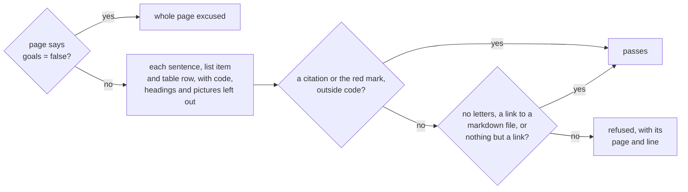

+++
title = "Citations"
subtitle = "every statement traced to its source"
status = "approved"
categories = ["Refusals"]
intent = """
Citations exist so that a reader who cannot read the code can still tell a checked sentence from a guess.
Every statement should lead to the code it came from, or to the documentation of the outside service it
describes, or say plainly that nothing was found.
"""

[[infobox]]
group = "Identity"
rows = [
  { label = "Syntax", value = "markdown footnote", cite = "render" },
  { label = "Mark", value = "{missing}", note = "for no source", cite = "mark" },
]

[[infobox]]
group = "Rules"
rows = [
  { label = "Unit checked", value = "sentence", cite = "uncited" },
  { label = "Infobox rows", value = "cited, or marked missing", cite = "rows" },
  { label = "Code samples", value = "not checked", cite = "excused" },
  { label = "Refused reference", value = "a link containing .md", cite = "document" },
  { label = "Outside documentation", value = "allowed, as a link without .md", cite = "document" },
  { label = "Exempt pages", value = "any page with goals = false", cite = "exempt" },
]
+++

A **citation** is a numbered mark at a claim, with its reference at the foot of the page, written as a
markdown footnote.[^render] Three checks hold citations to account: one each for a sentence and an infobox
row that cite nothing, and one for a reference that cites the wrong kind of thing.[^three]

## Silence

Every sentence must carry a citation, or the red mark that says there is none.[^uncited] If one does not,
the check names the page and the line, and quotes the sentence.[^uncited] **The check looks for the mark,
not the reference behind it**: a sentence naming a footnote the page never defines passes, and shows the
mark as plain text.[^undefined] Each statement passes or is refused this way.[^uncited]

A citation after the full stop belongs to its sentence, and **a sentence never borrows its neighbour's
citation**.[^uncited] A version number does not end a sentence, but an abbreviation followed by a capital
does, so `Dr. Smith` is read as two sentences.[^boundary] A sentence directly under a heading is checked
like any other.[^heading]

Four things are excused: a sentence linking to any markdown file, even one that does not exist; a list
item that is only a link; a code sample; and a picture with its caption.[^excused] **Every table row carries a citation, or the red mark, in at
least one of its cells**; a table whose rows cite nothing is a gap, not an excuse.[^rowcite]
The header row is exempt.[^rowcite]

An infobox row cites a footnote the page's text also cites, and carries that citation's number, or is
marked as having no source; a row with neither, or citing a footnote no sentence uses, is refused.[^rows]
A page that says `goals = false` is excused from both rules, whatever it describes.[^exempt]

## Red mark

Where nothing can be cited, the writer puts the word *missing* in curly braces, and it renders as a red
question mark in brackets.[^mark] **It is a fine answer; silence is not.**[^uncited] It means the thing is
not built or nobody has found where it happens, and to a reader both mean the same: do not take this on
faith.[^mark] A user build removes every mark.[^user] Inside code, the mark is shown as written and
counts for nothing.[^code]

Every build and check prints how many sources each page cites and how many claims it marks, with totals
for the wiki.[^counts] `wiki check` also lists every marked claim by page and line, without failing.[^marks]

## Documents

A reference whose link contains `.md` anywhere is refused, because a page of prose is only another claim
that can be wrong in the same way.[^document] Outside documentation passes when its address has no `.md`,
so **a README on GitHub is refused like a project document**.[^document] A reference that names a document
without linking to it passes, and so does one that names nothing.[^document]

[^render]: `src/builder/build.py` — `footnote_reference()`, `footnote_item()` and `footnote_block()`,
    registered in `make_markdown()`.
[^three]: `src/builder/build.py` — `uncited_problems()`, `infobox_problems()` and `citation_problems()`,
    each called from `check()`.
[^uncited]: `src/builder/build.py` — `uncited_problems()` reads each sentence from `page_statements()`,
    accepts one containing a `CLAIM` match, and quotes one that has none with `quoted()`.
[^undefined]: `src/builder/build.py` — `CLAIM` matches any footnote mark, whether or not the page defines
    that footnote; the footnotes plugin in `make_markdown()` leaves an undefined one as text.
[^boundary]: `src/builder/build.py` — `BOUNDARY` ends a sentence at a full stop, question or exclamation
    mark followed by a space and a capital, a digit, a quotation mark, code, emphasis or an opening
    bracket, and knows no abbreviations.
[^heading]: `src/builder/build.py` — `page_statements()` blanks every heading line with `HEADING_ANY`
    before reading the body.
[^excused]: `src/builder/build.py` — `uncited_problems()` skips a sentence matching `PAGE_LINK`, which
    looks for no file, or `LINK_ONLY`; `page_statements()` blanks fenced code with `FENCED` and skips a
    block that starts with `![`; `statements()` reads a block that starts with `|` row by row.
[^rowcite]: `src/builder/build.py` — `statements()` returns each row of a table after its header and
    `TABLE_SEPARATOR`, and `uncited_problems()` names a row with no citation or mark as a table row.
[^rows]: `src/builder/build.py` — `infobox_problems()`, and `render_infobox()`, which gives a cited row
    the number `footnote_reference()` recorded for its footnote.
[^exempt]: `src/builder/build.py` — `uncited_problems()` and `infobox_problems()` skip a page whose front
    matter says `goals = false`.
[^mark]: `src/builder/build.py` — `MISSING` and `MISSING_CITATION`, applied in `write_site()`.
[^user]: `src/builder/build.py` — `for_user()` removes every `INTERNAL_MARKER`.
[^code]: `src/builder/build.py` — `write_site()` draws the mark only outside `CODE_HTML`; `citation_counts()`,
    `missing_marks()` and `uncited_problems()` remove `INLINE_CODE` before looking for it.
[^counts]: `src/builder/build.py` — `citation_counts()`, printed by `report()`.
[^marks]: `src/builder/build.py` — `missing_marks()`, printed by `run()` in `src/builder/cli.py`.
[^document]: `src/builder/build.py` — `citation_problems()` matches `DOCUMENT_LINK`, a markdown link whose
    address contains `.md` anywhere, inside each footnote; its comment gives the reason.
