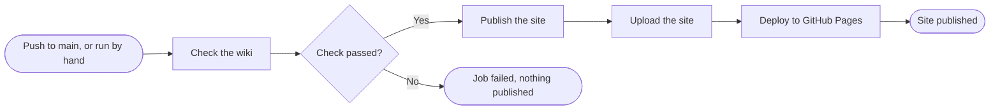

+++
title = "GitHub Pages"
subtitle = "a workflow that checks the wiki and deploys it to GitHub Pages"
status = "approved"
intent = """
This guide exists so that a project on GitHub can publish its wiki as a website for free, read by people
who never open the repository, and only in a state that passed its checks. A project should get there with
one workflow and a DNS record.
"""

[[infobox]]
group = "Identity"
rows = [
  { label = "Host", value = "GitHub Pages", cite = "pages" },
  { label = "Commands", value = "wiki check, wiki publish", cite = ["flow", "pages"] },
]

[[infobox]]
group = "Values"
rows = [
  { label = "Price", value = "free", note = "for a public repository", cite = "plans" },
]

[[infobox]]
group = "Rules"
rows = [
  { label = "Condition", value = "wiki check passes", cite = "order" },
  { label = "Custom domain", value = "set in the repository's Pages settings", note = "a CNAME file is ignored", cite = "domain" },
]
+++

A project on GitHub publishes its wiki with one workflow that checks the wiki, builds it with
`wiki publish` and hands the result to GitHub Pages.[^pages] If the check fails, the job stops and nothing
is published.[^order] What `wiki publish` makes is described on [wiki publish](commands/publish.md), and
the same guide for Cloudflare on [Cloudflare](deployment-cloudflare.md).

## Build

Every push to `main`, or a run started by hand, checks the wiki, publishes it only when the check passes,
and deploys what was published.[^flow]



The action installs `wiki` and leaves it installed, so a later step in the same job can run it.[^action]

```yaml
# .github/workflows/pages.yml
name: pages
on:
  push:
    branches: [main]
  workflow_dispatch:
permissions:
  contents: read
  pages: write
  id-token: write
jobs:
  build:
    runs-on: ubuntu-latest
    steps:
      - uses: actions/checkout@v4
      - uses: timothymarois/wiki-builder@TAG
      - run: wiki publish _site
      - uses: actions/upload-pages-artifact@v3
        with:
          path: _site
  deploy:
    needs: build
    runs-on: ubuntu-latest
    environment: github-pages
    steps:
      - uses: actions/deploy-pages@v4
```

## Settings

**GitHub Pages is switched on before the workflow first runs**: in the repository's settings, under
Pages and then Build and deployment, the source is GitHub Actions.[^source] Until it is, the build job
passes and the deploy job fails with a 404 saying to enable GitHub Pages.[^enable]

| Setting | Value |
|---|---|
| Pages source, under Build and deployment | GitHub Actions[^source] |
| Custom domain | the domain, entered in the repository's Pages settings[^domain] |
| DNS record | a `CNAME` from the domain to `ACCOUNT.github.io`[^dns] |
| HTTPS | enforced, once GitHub has issued the certificate[^https] |

A `CNAME` file in the published folder does nothing, because GitHub ignores it for a site deployed by a
custom workflow.[^domain] GitHub Pages is free for a public repository on GitHub Free, and publishing from
a private repository needs a paid plan.[^plans]

## Example

wiki-builder's own `pages` workflow checks and publishes its wiki on every push to `main`.[^pages] It
serves the result at wiki-builder.marois.dev.{missing}

## External links

- [Using custom workflows with GitHub Pages](https://docs.github.com/en/pages/getting-started-with-github-pages/using-custom-workflows-with-github-pages)
- [Managing a custom domain for your GitHub Pages site](https://docs.github.com/en/pages/configuring-a-custom-domain-for-your-github-pages-site/managing-a-custom-domain-for-your-github-pages-site)
- [Securing your GitHub Pages site with HTTPS](https://docs.github.com/en/pages/getting-started-with-github-pages/securing-your-github-pages-site-with-https)
- [GitHub Pages limits](https://docs.github.com/en/pages/getting-started-with-github-pages/github-pages-limits)
- [actions/deploy-pages](https://github.com/actions/deploy-pages)

[^pages]: `.github/workflows/pages.yml` — the `build` job checks the wiki and runs `wiki publish _site`,
    and the `deploy` job runs `actions/deploy-pages`, on every push to `main`.
[^flow]: `.github/workflows/pages.yml` — runs `on` a push to `main` or `workflow_dispatch`; the `build`
    job checks the wiki through `./`, runs `wiki publish _site`, writes `_site/CNAME` and uploads the site
    with `actions/upload-pages-artifact`; `deploy` needs `build` and runs `actions/deploy-pages`.
    `action.yml` — its last step runs `wiki check`, and a failing step stops the job.
[^order]: `.github/workflows/pages.yml` — `deploy` needs `build`, whose first step after checkout is the
    check.
[^action]: `action.yml` — installs wiki-builder with `pip` into the Python `actions/setup-python` puts on
    the path.
[^source]: GitHub Docs — [Configuring a publishing source for your GitHub Pages site](https://docs.github.com/en/pages/getting-started-with-github-pages/configuring-a-publishing-source-for-your-github-pages-site):
    under Settings, Pages, "Build and deployment", the source is set to GitHub Actions; and
    [Using custom workflows with GitHub Pages](https://docs.github.com/en/pages/getting-started-with-github-pages/using-custom-workflows-with-github-pages):
    custom workflows must first be enabled for the repository.
[^enable]: GitHub — [actions/deploy-pages](https://github.com/actions/deploy-pages/blob/v4/src/internal/deployment.js):
    when creating the deployment returns 404, the error adds "Ensure GitHub Pages has been enabled".
[^domain]: GitHub Docs — [Managing a custom domain for your GitHub Pages site](https://docs.github.com/en/pages/configuring-a-custom-domain-for-your-github-pages-site/managing-a-custom-domain-for-your-github-pages-site):
    the domain is entered under Settings, Pages and Custom domain, and a site published from a custom
    GitHub Actions workflow ignores any existing `CNAME` file.
[^dns]: GitHub Docs — [Managing a custom domain for your GitHub Pages site](https://docs.github.com/en/pages/configuring-a-custom-domain-for-your-github-pages-site/managing-a-custom-domain-for-your-github-pages-site):
    a subdomain needs a `CNAME` record pointing to `<user>.github.io` or `<organization>.github.io`,
    without the repository name.
[^https]: GitHub Docs — [Securing your GitHub Pages site with HTTPS](https://docs.github.com/en/pages/getting-started-with-github-pages/securing-your-github-pages-site-with-https):
    **Enforce HTTPS** is in the repository's Pages settings, and the certificate is provisioned after the
    DNS check that starts when the custom domain is set.
[^plans]: GitHub Docs — [GitHub's plans](https://docs.github.com/en/get-started/learning-about-github/githubs-plans):
    GitHub Free includes GitHub Pages in public repositories, and GitHub Pro and GitHub Team add it for
    private repositories.
