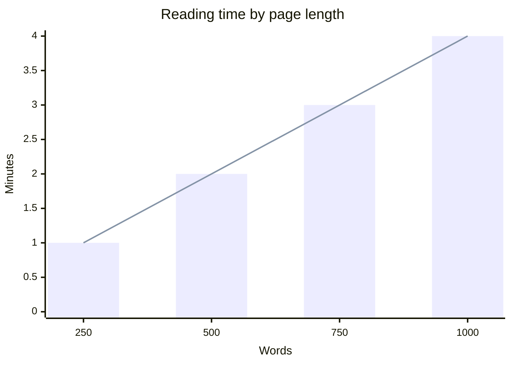
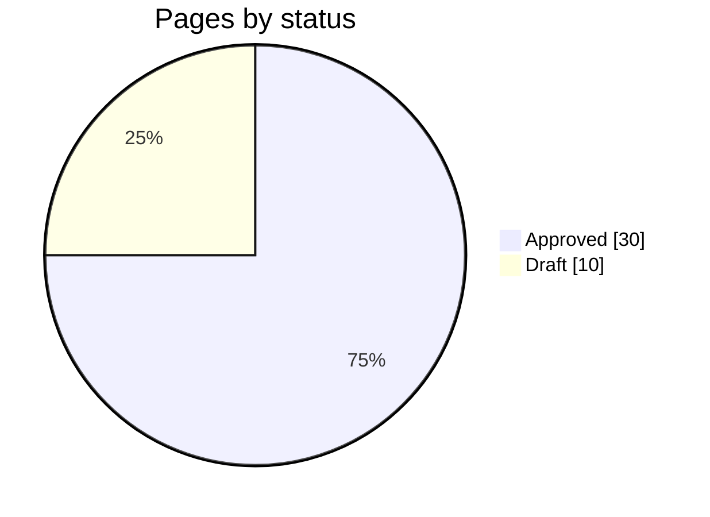
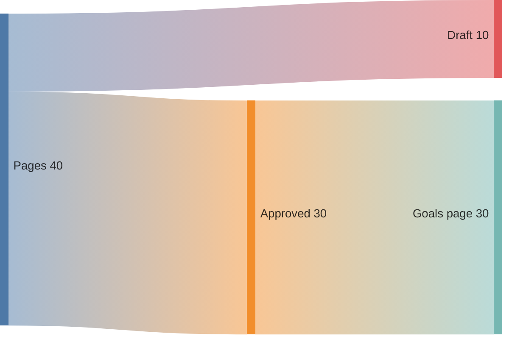
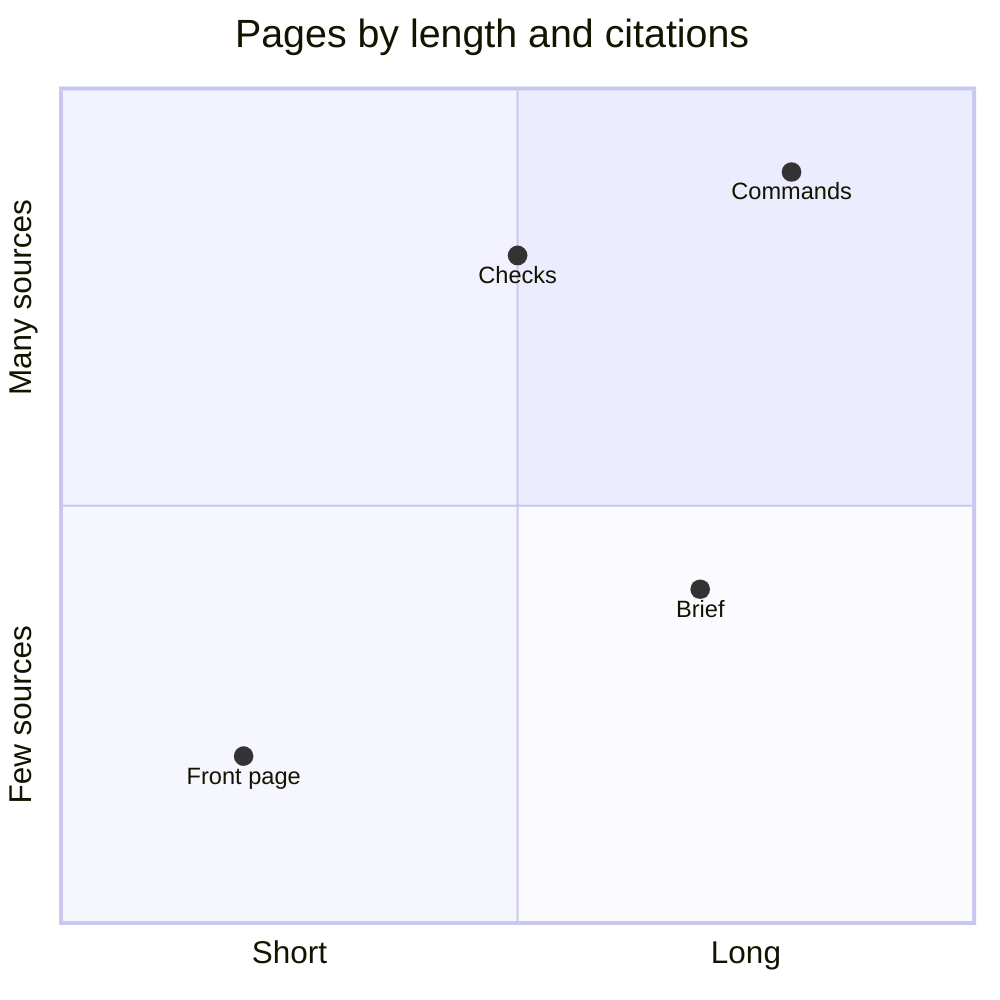
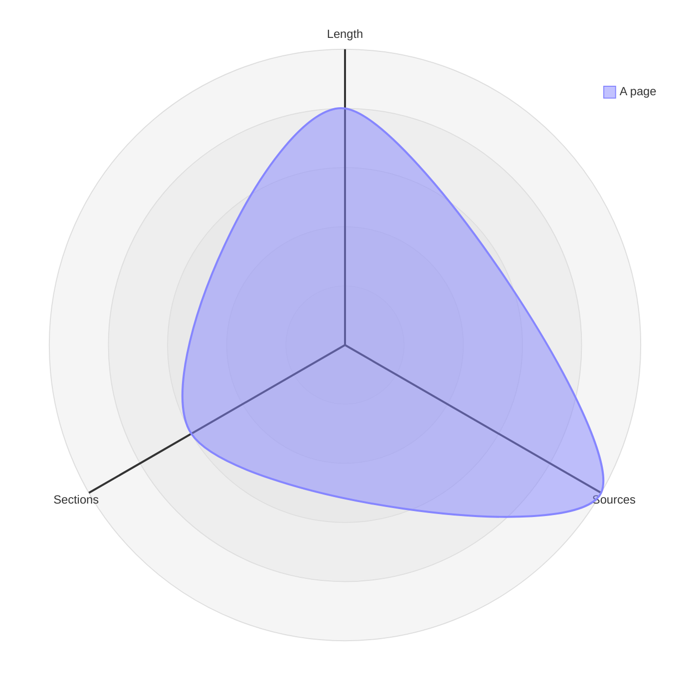

+++
title = "Charts"
subtitle = "bar, line, pie, flow, quadrant and radar charts written as mermaid blocks"
status = "approved"
intent = """
A chart exists so that figures a page states can be seen as a shape — a rise, a share, a split — rather
than counted out of a sentence. It is written as text beside the prose, so the numbers drawn stay with the
sentence that cites them. A chart is never the only place a number appears, because a drawing cannot be
searched or read aloud.
"""

[[infobox]]
group = "Identity"
rows = [
  { label = "Syntax", value = "a mermaid code block", cite = "block" },
  { label = "Kinds", value = "xychart-beta, pie, sankey-beta, quadrantChart, radar-beta", cite = "kinds" },
  { label = "Renderer", value = "Mermaid 12.0.0", cite = "script" },
]

[[infobox]]
group = "Rules"
rows = [
  { label = "Network", value = "none needed", cite = "script" },
  { label = "Citation", value = "on the sentence before it", note = "the skill's rule, which no check enforces", cite = "rules" },
  { label = "Reading budget", value = "not counted", cite = "budget" },
]
+++

A **chart** is a `mermaid` code block whose first word names a kind of chart, and the site draws it as a
picture instead of showing its text.[^block] It is the block a diagram is written in, described on
[Diagrams](diagrams.md): a diagram draws how something works, and a chart draws how much.

## Kinds

Mermaid draws five kinds of chart, each named by the block's first word.[^kinds] Three of them —
`xychart-beta`, `sankey-beta` and `radar-beta` — are Mermaid's beta syntax, which a later release of
Mermaid may change.[^beta]

### Bars and lines

A page's footer gives its reading time in whole minutes at 250 words a minute, so a page at the 500-word
budget reads in two and one of 1000 words in four.[^minutes] One `xychart-beta` block draws those figures
twice, as bars from zero and as a line across the same axes.[^kinds]

### Shares

A pie chart draws the parts of one whole as slices, and `showData` prints each value beside its
name.[^kinds]

### Flows

A sankey chart draws a quantity splitting as it passes from one stage to the next, each band as wide as
what flows through it.[^kinds]

### Two scales

A quadrant chart places each point on two scales at once and names the four quarters they
make.[^kinds]

### Several scales

A radar chart draws one thing measured on several scales at once, as a shape closing back on
itself.[^kinds]

## Drawing

A chart needs no network: Mermaid ships inside wiki-builder, and a build copies it, with its license, into
a site only when some page draws something.[^script] It is drawn in the page's theme, light or dark, and
drawn again whenever the theme changes.[^theme] **Its colors are the wiki's own**, one set of six chosen
to stay apart for a reader who cannot tell red from green, with the text and rules of the page around
it.[^colors] **Two charts on one page each keep their own box**: every
drawing on a page is numbered rather than named after the millisecond it began, which two charts share,
leaving the second sized against the first and painted over it.[^named] A chart Mermaid cannot read passes
`wiki check`, and the page shows Mermaid's error in its place.[^error]

## Numbers

The skill tells an agent that a chart draws only figures the page states and cites, that the sentence
introducing it carries the citation, and that a figure changing faster than the page is not drawn at all;
no check enforces any of the three.[^rules][^cite] A chart costs nothing against the page's reading budget,
because the build counts words with the code blocks taken out.[^budget] A page's markdown copy keeps a
chart as the block it was written as, which is how an agent reads it.[^copy]

[^block]: `src/builder/build.py` — `write_site()` turns a rendered block matching `MERMAID_BLOCK`, a
    `language-mermaid` code block, into `pre.mermaid`, whatever the block draws.
[^kinds]: Mermaid — [XY chart](https://mermaid.js.org/syntax/xyChart.html),
    [Pie chart](https://mermaid.js.org/syntax/pie.html), [Sankey](https://mermaid.js.org/syntax/sankey.html),
    [Quadrant chart](https://mermaid.js.org/syntax/quadrantChart.html) and
    [Radar](https://mermaid.js.org/syntax/radar.html): each block's first word, the axis, title and data
    lines it takes, `showData` beside a pie's slices, and one `xychart-beta` block drawing bars and a line
    together.
[^beta]: Mermaid — [XY chart](https://mermaid.js.org/syntax/xyChart.html),
    [Sankey](https://mermaid.js.org/syntax/sankey.html) and [Radar](https://mermaid.js.org/syntax/radar.html):
    each is documented as beta syntax.
[^minutes]: `src/builder/build.py` — `reading_minutes()` divides a page's words by `READING_PACE`, 250, and
    rounds up to whole minutes, never fewer than one; `src/builder/config.py` — `DEFAULT_BUDGET` sets a
    page's budget to 500 words.
[^script]: `src/builder/build.py` — `MERMAID` and `MERMAID_LICENSE` sit in the package's assets, and
    `write_site()` copies both into the site only when some page has a drawing;
    `src/builder/assets/wiki.js` — `loadMermaid()` fetches the bundled script once a drawing comes within
    600 pixels of the screen.
[^theme]: `src/builder/assets/wiki.js` — `drawDiagrams()` sets Mermaid's theme to dark when the page's
    theme is dark or follows a dark system, and the theme button and a change in the system's color
    scheme call it again.
[^colors]: `src/builder/assets/wiki.js` — `chartColours()` gives Mermaid a palette, text and rules for
    the page's theme, and `recolourFlows()` puts the same colors over the scheme Mermaid paints a sankey
    from; `src/builder/assets/wiki.css` — `.art pre.mermaid`, whose rules size a chart and stop a sankey's
    bands being multiplied into the page.
[^named]: `src/builder/assets/wiki.js` — `drawDiagrams()` initializes Mermaid with `deterministicIds`, so
    each drawing on a page is numbered instead of named after `Date.now()`, which two drawings begun in one
    millisecond share.
[^error]: Mermaid — [Mermaid Config Schema](https://mermaid.js.org/config/schema-docs/config.html):
    `suppressErrorRendering` is what stops Mermaid inserting its "Syntax error" diagram;
    `src/builder/assets/wiki.js` — `drawDiagrams()` leaves it unset.
[^rules]: `src/skill/SKILL.md` — the Charts section; `src/skill/references/charts.md` — the numbers a chart
    may draw.
[^cite]: `src/builder/build.py` — `page_statements()` blanks fenced code with `FENCED` before reading
    sentences, and no check looks for the sentence before a code block.
[^budget]: `src/builder/build.py` — `read_pages()` counts words after `FENCED` removes code blocks.
[^copy]: `src/builder/build.py` — `markdown_copy()` passes fenced code through `outside_code()` unchanged.
