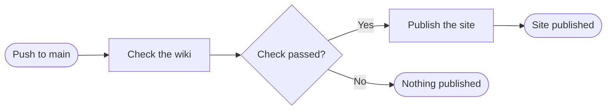
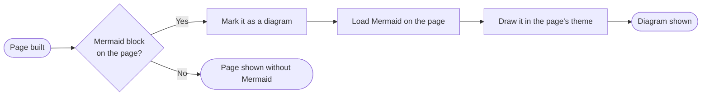

+++
title = "Diagrams"
subtitle = "flowcharts and other drawings, written as text"
status = "approved"
intent = """
Diagrams exist so that a flow, a sequence or a decision can be drawn on a page, written as text the way
GitHub and markdown already allow. A diagram should be readable wherever the page is read, with or
without a network.
"""

[[infobox]]
group = "Identity"
rows = [
  { label = "Syntax", value = "a mermaid code block", cite = "block" },
  { label = "Renderer", value = "Mermaid 12.0.0", cite = "script" },
]

[[infobox]]
group = "Rules"
rows = [
  { label = "Network", value = "none needed", cite = "script" },
  { label = "Citation", value = "on the sentence before it", note = "the skill's rule, which no check enforces", cite = "rules" },
  { label = "Reading budget", value = "not counted", cite = "budget" },
]
+++

A **diagram** is a code block whose language is `mermaid`, and the site draws it as a picture instead of
showing its text.[^block] Mermaid is the diagram language GitHub draws from the same block, so one page
reads as a diagram on GitHub and on the wiki.[^github] How a page is written in general is described on
[Pages](../pages.md).

## Writing

A diagram is written between fences that name its language as `mermaid`.[^block]

````markdown
Every push checks the wiki before it is published.[^flow]


````

## Drawing

Only a page with a mermaid block loads Mermaid, and its block is drawn in three steps.[^block][^script][^theme]



**A diagram needs no network**: Mermaid ships inside wiki-builder, and a build copies it, with its
licence, into a site only when some page has a diagram.[^script] A diagram is drawn in the page's theme,
light or dark, and is drawn again whenever the theme changes, whether the reader switches it or the system
does.[^theme] It sits centred without a frame, and shrinks to fit when it is wider than the
page.[^style][^width] A diagram Mermaid cannot read passes `wiki check`, and the page shows Mermaid's error
in its place.[^cite][^error]

## Citations

The skill tells an agent that the sentence introducing a diagram carries the citation, and that every box
and arrow is something the cited code does; no check enforces either.[^rules][^cite] The check does not
read inside a code block, so a diagram is never refused for citing nothing.[^cite] It costs nothing
against the page's reading budget.[^budget]

## Copies

A page's markdown copy keeps a diagram as the block it was written as, which is how an agent reads
it.[^copy] The copies are described on [Agent markdown](../site/agent-markdown.md), and wiki-builder's own
diagrams are on [Checks](../checks.md), [Citations](../checks/citations.md) and
[Deployment (GitHub)](../deployment-github.md).

[^block]: `src/builder/build.py` — `write_site()` turns a rendered block matching `MERMAID_BLOCK`, a
    `language-mermaid` code block, into `pre.mermaid`.
[^github]: GitHub Docs — [Creating diagrams](https://docs.github.com/en/get-started/writing-on-github/working-with-advanced-formatting/creating-diagrams):
    GitHub draws a fenced code block marked `mermaid` as a diagram.
[^script]: `src/builder/build.py` — `MERMAID` and `MERMAID_LICENSE` sit in the package's assets;
    `write_site()` gives a page the script only when it has a diagram, and copies both into the site only
    when some page does.
[^theme]: `src/builder/assets/wiki.js` — `drawDiagrams()` keeps each diagram's text, sets Mermaid's theme
    to dark when the page's theme is dark or follows a dark system, and draws every `pre.mermaid`; the
    theme button and a change in the system's colour scheme call it again.
[^style]: `src/builder/assets/wiki.css` — `.art pre.mermaid`.
[^width]: Mermaid — [Mermaid Config Schema](https://mermaid.js.org/config/schema-docs/config.html):
    `useMaxWidth`, true by default, sets a diagram's width to 100% and scales it with the available space;
    `src/builder/assets/wiki.js` — `drawDiagrams()` leaves it unset.
[^error]: Mermaid — [Mermaid Config Schema](https://mermaid.js.org/config/schema-docs/config.html):
    `suppressErrorRendering` is what stops Mermaid inserting its "Syntax error" diagram;
    `src/builder/assets/wiki.js` — `drawDiagrams()` leaves it unset.
[^rules]: `src/skill/SKILL.md` — the Diagrams section.
[^cite]: `src/builder/build.py` — `page_statements()` blanks fenced code with `FENCED` before reading
    sentences, and no check looks for the sentence before a code block.
[^budget]: `src/builder/build.py` — `read_pages()` counts words after `FENCED` removes code blocks.
[^copy]: `src/builder/build.py` — `markdown_copy()` passes fenced code through `outside_code()` unchanged.
