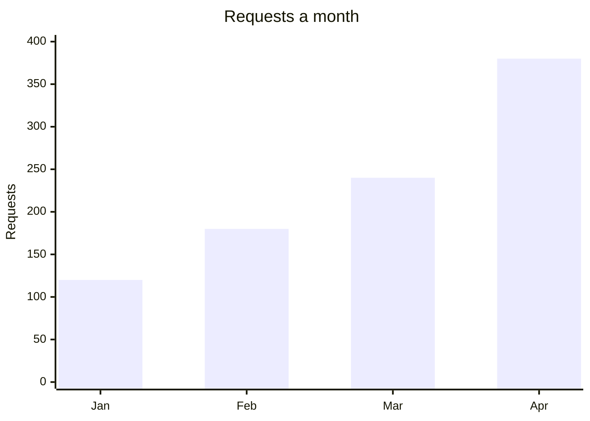

# Charts

Read this before drawing a chart on a page. `SKILL.md` holds the rules every chart obeys — it draws figures
the page already states and cites, and it never holds a figure on its own. This holds how to design one a
reader learns something from: when a chart beats a table, which kind to draw, where its numbers come from,
how it is labelled, and how it sits on the page.

A chart is written as a `mermaid` block, like a diagram, and the first word of the block says which kind it
is. **A diagram draws how something works; a chart draws how much.** Read
[Flowcharts](flowcharts.md) for the other half.

## Purpose

- **Draw when the shape is the point.** A rise across twelve months, one share dwarfing the rest, two runs
  crossing: those are seen in a drawing and counted out of a table. A reader who wants the values wants a
  table.
- **Three or four numbers are a sentence.** "Two in three pages are approved" needs no drawing, and a
  chart of it takes a reader longer than the sentence did.
- **A table is the default.** It is searched, read aloud, copied into a markdown copy and compared row by
  row; a chart is none of those. Draw one when what it shows survives being described in the sentence above
  it — and if it does not, the chart was carrying the page.
- **One question per chart.** Say it in the sentence that introduces the chart. A chart answering two
  questions is two charts.
- **Never more series than a reader can follow** — about four. Past that, the legend is the work and the
  drawing is decoration.

## Kind

Choose the chart by the question, then write its block. Mermaid draws each.

| The question is about | Draw | Mermaid |
|---|---|---|
| A figure across an ordered run — months, releases, sizes | a bar or line chart | `xychart-beta` |
| The parts of one whole, at one moment | a pie chart | `pie showData` |
| A quantity splitting as it passes through stages | a flow chart | `sankey-beta` |
| Where things fall on two scales at once | a quadrant chart | `quadrantChart` |
| One thing measured on several scales at once | a radar chart | `radar-beta` |

- **Bars for counts that stand apart, a line for a run that continues.** A line says the space between two
  points means something: a line across categories claims a trend that does not exist. One `xychart-beta`
  block draws both on one pair of axes, which is how a count and its running total go together.
- **A pie only for parts of one whole, and about five at most.** A reader compares angles far worse than
  lengths, so a pie with eight slices is a table pretending to be a picture. Slices that do not sum to the
  whole are bars.
- **`xychart-beta`, `sankey-beta` and `radar-beta` are Mermaid's beta syntax.** They draw today; their
  syntax may change under a later Mermaid. A chart that stops drawing shows the reader an error where the
  picture was, so check every chart on the page after the tool is updated.

## Numbers

A chart is the one place on a page where a false figure looks authoritative, so the numbers are held to
more than the prose, not less.

- **Every number comes from the same three sources as any sentence**: the code, the stated requirements, or
  an outside service's own documentation. A figure that is about right, illustrative or remembered is not
  drawn.
- **The prose states the figures the chart draws**, at least the ones that carry the point: the first and
  the last, the largest, the one that surprises. A reader who cannot see the drawing loses nothing, and a
  search for the number finds the page.
- **A chart is not a citation.** The sentence introducing it carries the reference, exactly as a diagram's
  does, and a chart of numbers nothing cites is `{missing}` on that sentence.
- **Never draw a figure that moves faster than the page.** A count that is different next week belongs to
  whatever reports it, not to a page that states what the system does. A chart of a moving figure is stale
  the day after it is drawn, and nothing on the page says so.
- **Round to what a reader can feel**, and give the unit in the axis title, never in the numbers.
- **A bar axis starts at zero.** A bar says "this much", and one cut off at the bottom says it wrongly. A
  line chart showing a change may start elsewhere, and the axis says where.

## Labels

- **The title is a noun phrase naming what is measured**, as a heading would be: "Requests a month", not
  "How requests grew".
- **An axis title names the quantity and its unit**: "Requests", "Words", "Size in MB". A bare axis leaves
  the reader guessing what the numbers count.
- **Name every part as the page names it.** A slice, a series or a stage takes the word the prose uses for
  the same thing, with the case a name the software owns keeps.
- **No abbreviations.** They are the first thing a reader stops to decode, and a chart is meant to be read
  at a glance.
- **Quote every label** in the block, so a comma or a colon in one cannot break the chart.

## Colour

- **Colour never carries meaning on its own.** It is lost in the other theme and to a reader who cannot see
  it, so a series is named by its label and its legend, never by "the blue one".
- **Never set colours in the block.** A chart is drawn in the page's theme, light and dark, and drawn
  again when the reader switches; a colour written into the block survives only one of them.

## On the page

- **Introduce it with a complete sentence** that says what the chart shows and carries its citation, and
  put the chart straight after.
- **Give it an accessible title and description** inside the block: `accTitle`, a noun phrase naming the
  chart, and `accDescr`, one or two sentences giving its shape and the figures at each end. For a chart,
  the description is the whole content for a reader using a screen reader, so it carries the numbers, not
  just the subject.
- **The block costs nothing against the page's reading budget**, which is a reason to keep the prose that
  states its figures, not a licence to draw instead of writing.

## Worked example

Two drawings of one month-by-month count. The first is what a first draft usually looks like:

```mermaid
xychart-beta
    title "Data"
    x-axis [1, 2, 3, 4]
    y-axis 100 --> 400
    line [120, 180, 240, 380]
```

- **Title:** "Data" names nothing; the reader cannot tell what is counted.
- **Axes:** no unit on the values, and the run is labelled 1 to 4 rather than by what those points are.
- **Baseline:** the value axis starts at 100, so the last bar looks four times the first when it is three.
- **Kind:** a line across four separate counts claims a trend between them.
- **Nothing accessible:** no `accTitle` or `accDescr`, so a reader who cannot see it gets nothing at all.

The same count, drawn to these rules:

````markdown
Requests rose from 120 in January to 380 in April, and the running total crossed 900 in
March.[^requests]


````

It is introduced by a cited sentence carrying the figures a reader needs, names what is counted and in what
unit, labels the run by its months, starts at zero, and describes itself for a reader who cannot see it.

## Last pass

1. **Cover the chart and read the page.** The point the chart made is still there, in the sentence above
   it, with its citation.
2. **Read every number against its source**, as the prose is read: the code, the stated requirements, or an
   outside service's documentation.
3. **Read only the labels.** The title names what is measured, each axis names its quantity and unit, and
   every part is named as the page names it.
4. **Ask what a table would have cost.** If the answer is nothing, write the table.
5. **Read the `accDescr` alone.** It should leave a reader who never sees the drawing knowing what it
   showed.
6. **Look at the built page in both themes**, because a chart is the one thing on a page that is not drawn
   until the reader opens it.

## Sources

- Mermaid — [XY chart](https://mermaid.js.org/syntax/xyChart.html),
  [Pie chart](https://mermaid.js.org/syntax/pie.html),
  [Sankey](https://mermaid.js.org/syntax/sankey.html),
  [Quadrant chart](https://mermaid.js.org/syntax/quadrantChart.html) and
  [Radar](https://mermaid.js.org/syntax/radar.html): the syntax of each chart, the axis and title lines it
  takes, and which of them Mermaid marks as beta.
- Mermaid — [Accessibility](https://mermaid.js.org/config/accessibility.html): `accTitle` and `accDescr`,
  which every chart kind accepts, and what a screen reader announces from them.
- William Cleveland and Robert McGill — [Graphical Perception: Theory, Experimentation, and Application to
  the Development of Graphical Methods](https://www.jstor.org/stable/2288400), Journal of the American
  Statistical Association 79 (1984): position along a common scale is judged more accurately than angle or
  area, which is why a length beats a slice.
- Financial Times — [Visual Vocabulary](https://github.com/Financial-Times/chart-doctor/tree/main/visual-vocabulary):
  which chart suits which relationship — change over time, part to whole, magnitude, flow and
  distribution among them.
- W3C — [Complex images](https://www.w3.org/WAI/tutorials/images/complex/): a short description to identify
  a drawing and a long description of what it shows, available to every user.
- Google — [Diagrams, figures, and other images](https://developers.google.com/style/images): introduce an
  image with a complete sentence, and describe a complex one in the text.
