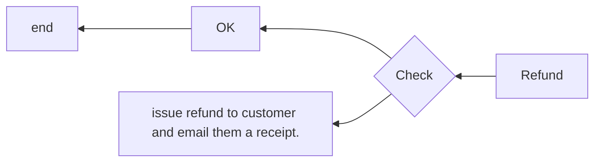
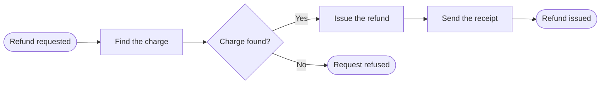

# Flowcharts

Read this before drawing a diagram on a page. `SKILL.md` holds the rules every diagram obeys — it states
behavior, so the sentence introducing it is cited and every box and arrow is something the code does.
This holds how to design one a reader can follow at a glance: when to draw, which kind, its shapes, its
direction, its labels, and how it sits on the page.

A diagram is a map of what the page says, drawn so the shape of the thing is visible before a word of it
is read. **A reader should be able to trace the main path with a finger in a few seconds**, and find where
their own case leaves it.

## Purpose

- **Draw when the thing branches, loops, or passes between parts.** A decision that takes three clauses to
  say, a retry, a hand-off between two services: those are what a drawing shows better than prose. A
  straight run of steps with no choice in it is a numbered list, not a diagram.
- **Decide the single question the diagram answers before drawing it** — "what happens to a refund request",
  "how a session ends" — and say it in the sentence that introduces it. A diagram that answers two
  questions is two diagrams.
- **Chart one level of detail.** Do not chart every step the code takes: a reader who wants every detail
  reads the page's references. A step with its own inner flow is drawn as one box, and its flow gets its
  own diagram, on its own page if it needs one.
- **About ten steps at most.** Past that, the main path is lost; split the chart into a top level and the
  diagrams its boxes stand for.

## Kind

Choose the diagram by what the question is about. Mermaid draws each.

| The question is about | Draw | Mermaid |
|---|---|---|
| Steps and the choices between them | a flowchart | `flowchart` |
| Messages between parties, in the order they are sent | a sequence diagram | `sequenceDiagram` |
| The states one thing moves through, and what moves it | a state diagram | `stateDiagram-v2` |

A flowchart that is really one thing changing state — draft, approved, archived — reads better as a state
diagram. A flowchart whose boxes are mostly "send" and "receive" is a sequence diagram.

## Shapes

One shape, one meaning, in every diagram on the wiki. These are the standard flowchart symbols, and a
reader who has seen a flowchart knows them already.

| Shape | Means | Mermaid |
|---|---|---|
| Rounded ends | where the flow starts, or one of the ways it ends | `id(["Refund requested"])` |
| Rectangle | a step: something is done | `id["Find the charge"]` |
| Diamond | a decision: the path splits on a condition | `id{"Charge found?"}` |
| Double-sided rectangle | a step whose own flow is drawn elsewhere | `id[["Issue the refund"]]` |
| Cylinder | stored data the flow reads or writes | `id[("Charges")]` |

- **Never use a shape, a color or a line style for decoration.** A reader looks for the meaning in every
  difference, and finds none.
- **Color never carries meaning on its own.** It disappears in the other theme, and for a reader who
  cannot see it.

## Direction

- **Top to bottom, or left to right.** Flow runs the way a page is read. Never bottom to top or right to
  left.
- **Left to right for a short chain** that fits the width of the page — about six boxes. **Top to bottom**
  for a longer flow, or one that branches deeply.
- **Keep the main path straight.** The usual case runs in one line from start to end; exceptions,
  refusals and failures branch off to one side and stay there.
- **Lines never cross.** Reorder the boxes, or split the diagram. A crossing is the first place a reader
  loses the path.
- **A line that runs back against the direction is a loop**, and it is labeled with why it goes back.

## Start and end

- **One start**, named for what sets the flow off: "Refund requested", "Push to main".
- **An end for each distinct outcome**, named for how the flow ended: "Refund issued", "Request refused".
  Two arrows that end the same way meet at one end.
- **Every path reaches an end.** A box with no way out is a question the diagram has left open.

## Labels

A label is the part a reader actually reads, so it follows the same naming rules as the page, with one
difference for decisions.

- **A step is a verb and its object**, in sentence case and the present tense: "Find the charge", "Write
  the site". Not a noun alone ("Charge"), and not a sentence with a full stop.
- **A decision is a short yes-or-no question**, ending in a question mark: "Charge found?". It is the only
  place a question is the right name, because the reader is choosing which way to go. Where the outcomes
  are not yes and no, label the exits with the outcomes instead: "Charge OK", "Charge declined".
- **Every exit from a decision is labeled**, and yes and no leave in the same order in every diagram.
- **An end is the outcome, as a noun phrase**: "Refund issued".
- **The page's words, exactly.** A box calls a thing what the page calls it, and a name the software owns
  keeps its case. No abbreviations: they are the first thing a reader has to stop and decode.
- **Short enough to fit**: about five words. Break a longer label with `<br/>` rather than letting a box
  grow into a paragraph; a label that needs more than two lines is two steps.

## On the page

- **Introduce it with a complete sentence** that says what the diagram shows and carries its citation, and
  put the diagram straight after.
- **The text still says everything the diagram shows.** A reader who cannot see the drawing, and a search
  for a word in it, both depend on the prose. The diagram is a map of rules the page states; it is never
  their only home.
- **Give it an accessible title and description** inside the block: `accTitle`, a noun phrase naming the
  flow, and `accDescr`, one or two sentences saying what it shows. Screen readers announce both.
- **Write `End`, never `end`, in a flowchart label.** Mermaid reads a lowercase `end` as the end of a block,
  and the diagram fails to draw.
- **Keep ids short and plain** — `find`, `found`, `issued` — and put every label in quotes, so punctuation in
  a label cannot break the diagram.

## Worked example

Two drawings of one refund flow. The first is what a first draft usually looks like:



- **Direction:** right to left, against the way the page is read.
- **Labels:** "Refund", "Check" and "OK" are nouns and adjectives; a reader cannot tell what is done or asked.
- **Decision:** the exits carry no labels, so either path could be the yes.
- **One box doing three things** — issue, email, receipt — in a sentence with a full stop.
- **Ends:** no start shape, no named outcome, and a lowercase `end` that stops the diagram drawing at all.

The same flow, drawn to these rules:

````markdown
A refund is issued only once its charge is found; otherwise the request is refused.[^refund]


````

It is introduced by a cited sentence that says the same thing, reads left to right, keeps the usual path in
one straight line, names every step with a verb, asks one question and labels both answers, and ends in two
named outcomes.

## Last pass

1. **Trace the main path** from start to end without reading the branches. It should take seconds.
2. **Read it against the code, arrow by arrow.** Every box is a step the code takes, every diamond a
   condition it tests, in the order it runs. A drawing of how the thing was meant to work is wrong.
3. **Read only the labels.** Steps are verbs with objects, decisions are questions, ends are outcomes, and
   every decision exit is labeled.
4. **Count.** About ten steps at most, no crossing lines, one start, every path at an end.
5. **Cover the diagram and read the page.** Everything it showed is still there in the text.

## Sources

- ISO — [ISO 5807:1985, documentation symbols and conventions for flowcharts](https://www.iso.org/standard/11955.html):
  the standard flowchart symbols and conventions, confirmed in 2019.
- IBM — [Flowcharting Techniques, C20-8152](https://www.bitsavers.org/pdf/ibm/generalInfo/C20-8152_Flowcharting_Techniques.pdf):
  flow runs top to bottom and left to right, with arrowheads wherever it does not; flowlines do not cross;
  wording avoids abbreviations; make the main line recognisable, and do not chart every detail.
- Wikipedia — [Flowchart](https://en.wikipedia.org/wiki/Flowchart): the common symbols and their meanings.
- Bruce Silver — [BPMN Method and Style rules](https://www.trisotech.com/bpmn-style-rules/) and
  [Gateways and end states](https://www.methodandstyle.com/blog/gateways-end-states-example-bpmn-style/):
  activities labeled verb-object, decisions labeled by end state or as a question with Yes and No, end
  states named for the outcome, about ten activities to a level.
- Google — [Diagrams, figures, and other images](https://developers.google.com/style/images): introduce an
  image with a complete sentence, and describe a complex one in the text.
- W3C — [Complex images](https://www.w3.org/WAI/tutorials/images/complex/): a short description to identify
  a diagram, and a long description of what it shows, available to every user.
- Mermaid — [Flowchart syntax](https://mermaid.js.org/syntax/flowchart.html) and
  [Accessibility](https://mermaid.js.org/config/accessibility.html): shapes, directions, quoted labels, the
  lowercase `end` that breaks a flowchart, and `accTitle` and `accDescr`.
